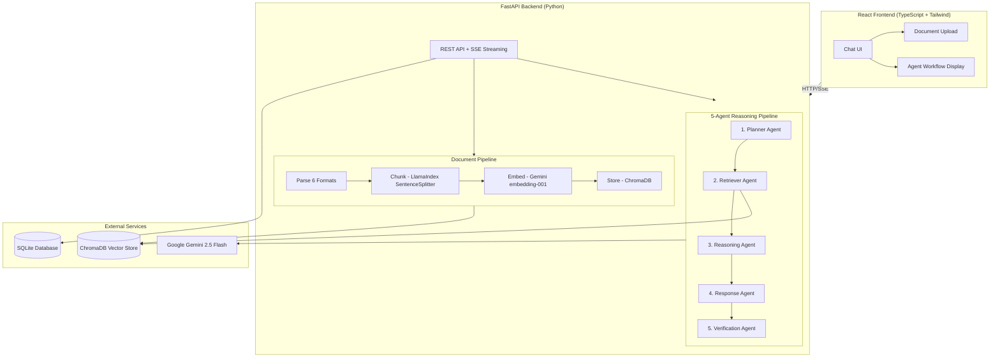

# GenAI Document Assistant

**Developed by Kinjal Mistry**

**[Live Demo (Render)](https://genai-doc-assistant-slnu.onrender.com)** | **[Live Demo (AWS)](http://100.29.17.139)** | [API Docs](https://genai-doc-assistant-slnu.onrender.com/docs)

AI-powered document Q&A application with RAG (Retrieval-Augmented Generation) pipeline and multi-agent reasoning. Upload documents in 6 formats, ask natural language questions, and get accurate, grounded answers — powered by a 5-agent AI reasoning pipeline.

> **Note:** The Render demo may take 30-60 seconds to wake up after inactivity. The AWS demo is always running.

## Architecture



### How It Works

```
Document Upload Flow:
  File → Validate (type, size) → Parse (PyPDF2/pandas/json/yaml)
  → Chunk (SentenceSplitter, 512 tokens) → Embed (Gemini) → Store (ChromaDB)

Query Flow (5-Agent Pipeline):
  Question → Planner (decompose query) → Retriever (vector search)
  → Reasoning (analyze chunks) → Response (generate answer)
  → Verification (check grounding) → Stream to user via SSE
```

## Tech Stack

| Layer | Technology |
|-------|-----------|
| Frontend | React 19, TypeScript, Vite, Tailwind CSS 4 |
| Backend | FastAPI, Python 3.11 |
| LLM | Google Gemini 2.5 Flash (free tier) |
| Embeddings | Gemini embedding-001 |
| Vector Store | ChromaDB (persistent) |
| Agents | LlamaIndex |
| Database | SQLite (async) |
| Deployment | Docker, Render.com |

## Features

- **6 Document Formats**: Upload PDF, TXT, CSV, Excel, JSON, and YAML files
- **Multi-Agent Reasoning**: 5-agent pipeline (Planner, Retriever, Reasoning, Response, Verification)
- **Real-Time Streaming**: Server-Sent Events for token-by-token response delivery
- **Agent Workflow Visualization**: See each agent's progress, timing, and results in the UI
- **Source Citations**: Every answer includes [Source N] references to specific document chunks
- **Output Verification**: Dedicated verification agent checks response grounding
- **Dark/Light Theme**: Toggle between themes
- **Conversation History**: Full chat history with search

## Live Demo

**https://genai-doc-assistant-slnu.onrender.com**

Try it out:
1. Upload a document (PDF, CSV, TXT, Excel, JSON, or YAML)
2. Ask a question about its content
3. Watch the 5-agent pipeline process your question in real-time
4. Get a grounded answer with source citations

## Quick Start

### Prerequisites
- Python 3.11+
- Node.js 20+ (for frontend development only)
- Google API Key ([Get one free](https://aistudio.google.com/apikey))

### Setup

```bash
# Clone and navigate
cd genai-doc-assistant

# Backend
python3 -m venv venv && source venv/bin/activate
pip install -r requirements.txt

# Frontend (for development only - pre-built dist is included)
cd frontend && npm install && cd ..

# Environment
cp .env.example .env
# Edit .env and add your GOOGLE_API_KEY
```

### Run Locally

```bash
# Terminal 1: Backend (serves pre-built frontend at localhost:8000)
source venv/bin/activate
python main.py

# Terminal 2: Frontend dev mode (optional, for UI development)
cd frontend
npm run dev
```

Open http://localhost:8000 (production build) or http://localhost:3000 (dev mode)

### Run with Docker

```bash
docker build -t genai-doc-assistant .
docker run -p 8000:8000 -e GOOGLE_API_KEY=your-key genai-doc-assistant
```

Open http://localhost:8000

## API Endpoints

| Method | Endpoint | Description |
|--------|----------|-------------|
| GET | `/api/health-check` | System health status |
| POST | `/api/upload-document` | Upload and process a document |
| GET | `/api/documents` | List uploaded documents |
| DELETE | `/api/documents/{id}` | Delete a document |
| POST | `/api/ask-questions` | Ask a question (SSE streaming) |
| GET | `/api/conversations` | List conversations |
| GET | `/api/conversations/{id}` | Get conversation with messages |
| POST | `/api/conversations` | Create conversation |
| DELETE | `/api/conversations/{id}` | Delete conversation |

Interactive API documentation: [Swagger UI](https://genai-doc-assistant-slnu.onrender.com/docs)

## Project Structure

```
genai-doc-assistant/
├── app/
│   ├── api/          # FastAPI route handlers
│   ├── services/     # Document parsing, chunking, embedding, RAG
│   ├── agents/       # LlamaIndex agent pipeline (5 agents)
│   ├── core/         # Config, database, models, logging
│   └── utils/        # Validators, rate limiter, text cleaner
├── frontend/         # React 19 + TypeScript + Tailwind
│   └── dist/         # Pre-built production frontend
├── data/sample/      # Sample documents for demo
├── docs/             # Architecture, API, agent workflow docs
├── aws/              # AWS EC2 deployment guide + scripts
├── main.py           # FastAPI entry point
├── Dockerfile        # Docker build (Python-only, pre-built frontend)
├── docker-compose.yml # Docker Compose for EC2 deployment
└── render.yaml       # Render.com deployment blueprint
```

## Documentation

- [System Architecture](docs/ARCHITECTURE.md)
- [Agent Workflow](docs/AGENT_WORKFLOW.md)
- [API Reference](docs/API_REFERENCE.md)
- [Limitations & Security](docs/LIMITATIONS.md)
- [AWS EC2 Deployment Guide](aws/DEPLOY_AWS.md)

## Deployment

### Option 1: Render.com (Free, always-on-ish)

1. Connect repo to Render.com > New Web Service > Docker
2. Set Root Directory to `genai-doc-assistant`
3. Add `GOOGLE_API_KEY` environment variable
4. Deploy (auto-builds from Dockerfile)

### Option 2: AWS EC2 + Docker (Free for 12 months)

1. Launch EC2 t3.micro (free tier)
2. SSH in and run the setup script
3. Add your API key and start with `docker compose up -d`

See the full [AWS Deployment Guide](aws/DEPLOY_AWS.md) for step-by-step instructions with AWS concepts explained.

### Rate Limiting & Cost Protection

Per-IP rate limiting protects the Gemini API from abuse:
- Chat: 30 queries/hour per visitor
- Uploads: 10 uploads/hour per visitor

Cost controls:
- Gemini API spend cap: $5/month (hard cap, usage pauses when reached)
- Google Cloud budget alert: $5/month with email notifications at 50%, 80%, 100%
- AWS budget alert: $1/month for EC2 free tier monitoring

## License

MIT
