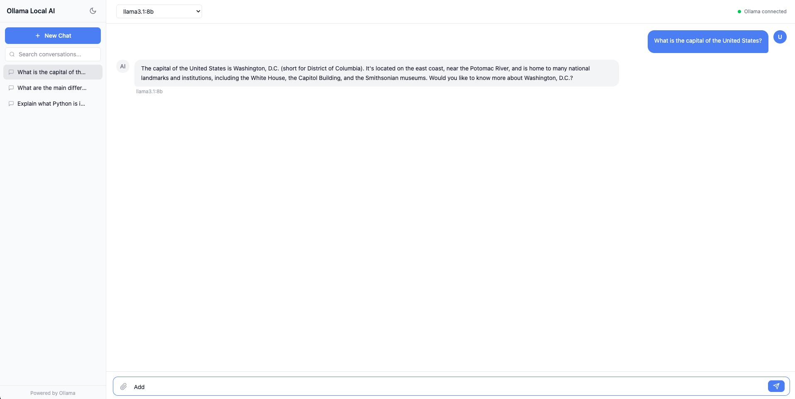

# Ollama RAG Chat

A fully offline, privacy-first AI chat application with document Q&A (RAG) capabilities. Runs entirely on your Mac -- no cloud, no API keys, no data leaves your machine.

Upload PDFs, text files, or Markdown documents and ask questions answered directly from their content. Conversations are persisted locally with full-text search. Streaming responses deliver tokens in real time for a responsive chat experience.

## Screenshot



## Features

- **100% Offline** -- after initial setup, no internet connection required
- **Document Q&A (RAG)** -- upload PDF, TXT, or Markdown files and chat with their contents
- **Streaming Responses** -- real-time token-by-token delivery via Server-Sent Events
- **Conversation History** -- persistent storage with full-text search across all chats
- **Multi-Model Support** -- switch between any Ollama model from the UI
- **Dark / Light Theme** -- toggle with preference saved across sessions
- **macOS App Launcher** -- double-click `.app` bundle to start everything
- **Drag & Drop Upload** -- drop files directly into the chat input area

## Quick Start

### Prerequisites

- macOS (Apple Silicon or Intel)
- [Homebrew](https://brew.sh)
- Python 3.10+
- Node.js 18+ (installed automatically by setup script if missing)

### One-Time Setup

```bash
cd ollama-rag-chat
chmod +x scripts/setup.sh
./scripts/setup.sh
```

This installs Ollama, pulls the required models (`llama3.1:8b` and `nomic-embed-text`), creates the Python virtual environment, installs dependencies, builds the React frontend, and creates a macOS app bundle.

### Launch

**Option A -- Shell script:**

```bash
./scripts/start.sh
```

**Option B -- macOS app:**

Double-click `scripts/Ollama RAG Chat.app` (or drag it to your Dock).

The app opens at [http://localhost:8000](http://localhost:8000).

## Tech Stack

| Layer | Technology | Purpose |
|---|---|---|
| LLM Runtime | [Ollama](https://ollama.com) | Local model server |
| Chat Model | llama3.1:8b | 8B parameter model, fits 16 GB RAM |
| Embeddings | nomic-embed-text | 768-dim vectors for RAG |
| Backend | [FastAPI](https://fastapi.tiangolo.com) | Async Python API server |
| ASGI Server | Uvicorn | Production-grade server |
| Streaming | SSE (sse-starlette) | Real-time token delivery |
| Vector Database | [ChromaDB](https://www.trychroma.com) | Embedded persistent vector store |
| SQL Database | SQLite (aiosqlite) | Conversations, messages, document metadata |
| PDF Parsing | PyMuPDF | Text extraction from PDFs |
| Frontend | [React 19](https://react.dev) + TypeScript | Component-based UI |
| Bundler | [Vite](https://vite.dev) | Fast dev server and production builds |
| Styling | [Tailwind CSS 4](https://tailwindcss.com) | Utility-first CSS |
| Launcher | Shell scripts + macOS Automator | One-click startup |

## Architecture

```
┌─────────────────────────────────────────────────────────┐
│                    macOS App / Browser                   │
│              http://localhost:8000                       │
├─────────────────────────────────────────────────────────┤
│                                                         │
│   ┌───────────────────────┐  ┌───────────────────────┐  │
│   │     React Frontend    │  │     FastAPI Backend    │  │
│   │                       │  │                       │  │
│   │  Sidebar              │  │  /api/chat (SSE)      │  │
│   │  ├─ Search            │  │  /api/conversations   │  │
│   │  └─ Conversation List │  │  /api/documents       │  │
│   │                       │  │  /api/health          │  │
│   │  Chat Area            │  │  /api/models          │  │
│   │  ├─ Model Selector    │  │                       │  │
│   │  ├─ Message Bubbles   │  │  Services:            │  │
│   │  ├─ Source Citations   │  │  ├─ OllamaService    │  │
│   │  └─ Input + Upload    │  │  ├─ RAGService        │  │
│   │                       │  │  └─ DocumentParser    │  │
│   └───────────────────────┘  └──────────┬────────────┘  │
│              │                          │                │
│              │     REST + SSE           │                │
│              └──────────────────────────┘                │
│                                                         │
├────────────────────────┬────────────────────────────────┤
│                        │                                │
│   ┌────────────────┐   │   ┌────────────────────────┐   │
│   │    ChromaDB    │   │   │       SQLite           │   │
│   │  (vector store)│   │   │  conversations         │   │
│   │                │   │   │  messages              │   │
│   │  doc_{uuid}    │   │   │  documents (metadata)  │   │
│   │  collections   │   │   │                        │   │
│   └────────────────┘   │   └────────────────────────┘   │
│                        │                                │
│   ┌────────────────────┴────────────────────────────┐   │
│   │              Ollama (localhost:11434)            │   │
│   │                                                 │   │
│   │  llama3.1:8b          nomic-embed-text          │   │
│   │  (chat completion)    (embeddings)              │   │
│   └─────────────────────────────────────────────────┘   │
│                                                         │
└─────────────────────────────────────────────────────────┘
```

### RAG Pipeline

```
Upload:   File ──▶ Parse (PyMuPDF) ──▶ Chunk (2000 chars, 200 overlap)
                                            │
                                            ▼
                                    Embed (nomic-embed-text)
                                            │
                                            ▼
                                    Store in ChromaDB

Query:    Question ──▶ Embed ──▶ Similarity Search (top 5)
                                            │
                                            ▼
                                    Build augmented prompt
                                    (question + context chunks)
                                            │
                                            ▼
                                    llama3.1:8b ──▶ Stream response
                                                    + source citations
```

### SSE Streaming Flow

1. Client sends `POST /api/chat` with message and optional document IDs
2. Backend saves the user message, retrieves conversation context (last 20 messages)
3. If documents are attached, RAG service queries ChromaDB and augments the prompt
4. Ollama streams tokens back; backend relays each as an SSE event
5. Frontend appends tokens to the assistant message bubble in real time
6. On completion, source citations and done signal are emitted
7. Full response is persisted to SQLite

### Event Types

| Event | Payload | Description |
|---|---|---|
| `conversation_id` | UUID string | Assigned when a new conversation is created |
| `token` | Text fragment | Single streamed token from the model |
| `sources` | Array of chunks | Retrieved document chunks with scores |
| `done` | -- | Stream complete |
| `error` | Error message | Something went wrong |

## Project Structure

```
ollama-rag-chat/
├── backend/
│   ├── app/
│   │   ├── main.py              # FastAPI entry point, lifespan hooks
│   │   ├── config.py            # Settings (env vars, defaults)
│   │   ├── database.py          # SQLite schema and connection
│   │   ├── models.py            # Pydantic request/response models
│   │   ├── routers/
│   │   │   ├── chat.py          # Chat + SSE streaming endpoint
│   │   │   ├── conversations.py # Conversation CRUD + search
│   │   │   ├── documents.py     # File upload and management
│   │   │   └── system.py        # Health check, model listing
│   │   └── services/
│   │       ├── ollama_service.py # Ollama API wrapper
│   │       ├── rag_service.py   # RAG pipeline (chunk, embed, query)
│   │       └── document_parser.py # PDF/text extraction
│   ├── data/                    # SQLite DB, ChromaDB, uploads
│   └── requirements.txt
├── frontend/
│   ├── src/
│   │   ├── App.tsx              # Root component
│   │   ├── components/
│   │   │   ├── Sidebar/         # Conversation list, search
│   │   │   └── Chat/            # Messages, input, model selector
│   │   ├── hooks/               # useChat, useConversations, useDocuments, useTheme
│   │   ├── api/client.ts        # Typed API client
│   │   └── types/index.ts       # TypeScript interfaces
│   ├── package.json
│   └── vite.config.ts
├── scripts/
│   ├── setup.sh                 # One-time install
│   ├── start.sh                 # Launch everything
│   └── create-app.sh            # Build macOS .app bundle
└── DESIGN.md                    # Detailed design document
```

## Configuration

All settings have sensible defaults and can be overridden via environment variables or a `.env` file in the backend directory.

| Variable | Default | Description |
|---|---|---|
| `OLLAMA_HOST` | `http://localhost:11434` | Ollama server URL |
| `DEFAULT_MODEL` | `llama3.1:8b` | Default chat model |
| `EMBEDDING_MODEL` | `nomic-embed-text` | Model for RAG embeddings |
| `CHUNK_SIZE` | `2000` | Characters per document chunk |
| `CHUNK_OVERLAP` | `200` | Overlap between chunks |
| `RAG_TOP_K` | `5` | Number of chunks retrieved per query |
| `MAX_UPLOAD_SIZE` | `52428800` | Max upload size in bytes (50 MB) |

## Development

### Backend

```bash
cd backend
python3 -m venv venv && source venv/bin/activate
pip install -r requirements.txt
uvicorn app.main:app --reload --host 127.0.0.1 --port 8000
```

API docs available at [http://localhost:8000/docs](http://localhost:8000/docs).

### Frontend

```bash
cd frontend
npm install
npm run dev
```

Dev server runs at [http://localhost:3000](http://localhost:3000) and proxies API calls to the backend.

## License

MIT
